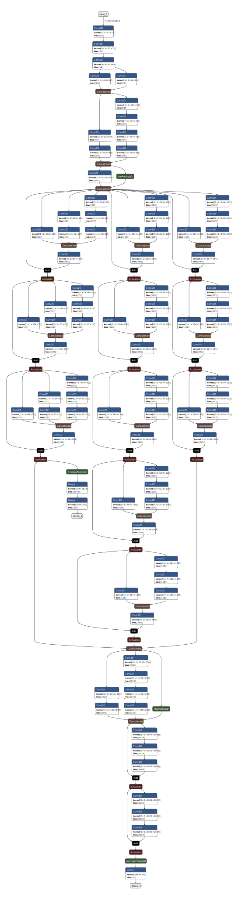

# How to create your own architecture?
### Steps to follow: <br>
- Develop an idea of architecture to implement. <br> 
- Import the cnn blocks from cnn_blocks.py file required for your architecture. <br>
Example:- <br>
```python
from cnn_blocks import inception_residual_block_A,inception_residual_block_B,inception_residual_block_C
from cnn_blocks import inception_block_reduction_A,inception_block_reduction_B
from cnn_blocks import residual_block_v2
```
- If you can't find the required cnn block try to create your own in a similar fashion as in cnn_blocks.py. <br> 
- Define input tensor. Note if input shape is less , you may want to decrease the no.of filters , kernel size or strides.<br> 
```python
input=Input(shape=(264,264,3))
```
- Stack the blocks squentially or parallely and make use of add and concatenate etc. <br> 
Example:- <br>
```python
import numpy as np
from keras import layers
from keras.layers import Input, Add, Dense, Activation, Flatten, Conv2D
from keras.layers import Input, ZeroPadding2D, BatchNormalization,  AveragePooling2D, MaxPooling2D, Dropout
from keras.models import Model
from keras.layers.merge import concatenate,add

branch1_1=inception_residual_block_A(input)
branch1_2=inception_residual_block_A(branch1_1)
branch1_3=inception_residual_block_A(branch1_2)
pool1=AveragePooling2D()(branch1_3)
fc1=Dense(1024,activation='relu')(pool1)
output1=Dense(n_classes,activation='softmax')(fc1)
```
- Define Model object and pass input and outputs <br> 
```python
model=Model(inputs=input,outputs=output1)
```
- Compile and save the model 
```python
model.compile(loss='categorical_crossentropy',optimizer='adam',metrics=['accuracy'])
model.save("your_file_path/MyOwnArchitecture.h5",save_format='h5')
```
<br> 
Here is an picture of an architecture that I created: <br> 


