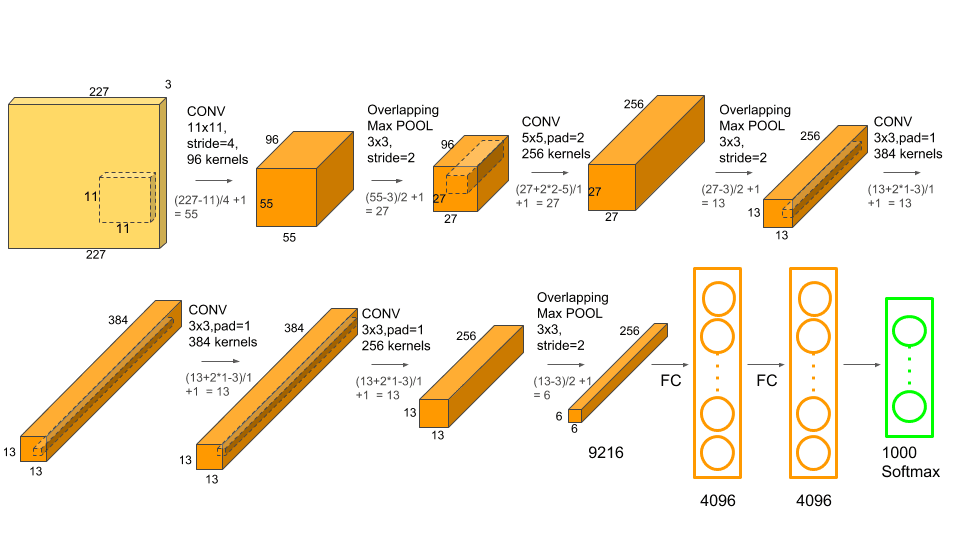

# CNN_Architectures
This repository contains all the famous CNN networks and compares them on tiny imagenet dataset. 

### About Dataset
How many classes are there in ImageNet?
200 classes
It was created for students to practise their skills in creating models for image classification. The Tiny ImageNet dataset has 100,000 images across 200 classes. Each class has 500 training images, 50 validation images, and 50 test images.

## Arch 1 :- LeNet 
### About 
LeNet-5, from the paper <b>Gradient-Based Learning Applied to Document Recognition</b>, is a very efficient convolutional neural network for handwritten character recognition.  
Paper: Gradient-Based Learning Applied to Document Recognition  
Authors: <b>Yann LeCun, Léon Bottou, Yoshua Bengio, and Patrick Haffner</b>  
Published in: Proceedings of the IEEE (1998)   

### Imp Points 
1) First ever implementation of backpropogation in Convolution Neural Network. 
2) Use of 5x5 Kernels with stride=1 in Convolution layer and 2x2 kernel with stride=2 in Average Pooling layer.   
   Activation function used originally - Sigmoid 
3) A kernel used in convolution layer would extract features out of input images via the concept called edge detection. Earlier these kernels were hard coded but use of Neural Network allowed these kernels to be made of trainable weights that could adjust themselves by the concept of backpropogation. 
4) No.of kernel used in LeNet were 6 in 1st layer and 16 in 2nd layer. More the number of kernels (or filters) more amount of features extracted in a layer.
5) Architecture :- 

## Arch 2 :- AlexNet
### About 
The motivation behind AlexNet was going depper in convolution layers. Increase in no.of convolution layers meant extracting minor details in image aka extracting "features of features". But going deeper meant requirement of large no.of trainable parameters demanding more computation power. AlexNet proposed various measures to overcome these limitations in 2012 ImageNet Competition.   
Author:<b> Alex Krizhevsky,Ilya Sutskever and Geoffrey Hinton</b>  

### Imp Points 
1) Large amount of filters used in conv layers ranging from 96 to 384.
2) 5 conv layers used with filter varying from 3x3 , 5x5 and 11x11. 
3) Earlier average pooling was being used which was a trainable layer. In AlexNet MaxPooling was introduced thereby making pooling layer a non-trainable layer reducing parameters to train. 
4) Several new small concepts were used for the first time in CNN which helped in increasing the depth of architecture like:
      --> Use of ReLu Activation function
      --> Use of Local Response Normalization becuase the output of ReLu is unbounded in nature.
      --> Concept of Dropout in Fully connected layers  to drop some neurons so as to prevent overfitting. ( Concept of deactivating neurons ) 
      
5) Use of Data augmentation- artificially increase the size of the training set-create a batch of "new" data from existing data by means of translation, flipping, noise.

6) Arch:-

## Arch 3 :- VGG
### About 
VGG is the Visual Geometry Group from Oxford University.The original purpose of VGG's research on the depth of convolutional networks is to understand how the depth of convolutional networks affects the accuracy of large-scale image classification and recognition.  
Paper: <a href="https://arxiv.org/pdf/1409.1556.pdf">Very Deep Convolutional Networks for Large-Scale Image Recognition</a>   
Author:<b>K. Simonyan and A. Zisserman from the University of Oxford</b>  

### Imp Points 
1) A smaller 3 * 3 convolution kernel and a deeper network are used.The stack of two 3 * 3 convolution kernels is relative to the field of view of a 5 * 5 convolution kernel, and the stack of three 3 * 3 convolution kernels is equivalent to the field of view of a 7 * 7 convolution kernel. In this way, there can be fewer parameters (3 stacked 3 * 3 kernel have only 3*3*3=27 parameters whereas single 7 * 7 fitler has 49 paramters ( about 55% less in 3*3*3);on the other hand, they have more The non-linear transformation thereby increasing the ability of CNN to learn features.
2) One of the most symmetrical architecture in CNN. 3x3 Conv layers stacked on top of each other with increasing no.of filters in multiple of 2 starting from 64. After every two or three conv layers the output is maxpooled. 
3) Input is bit different in VGG: The input of VGG is set to an RGB image of 224x244 size. The average RGB value is calculated for all images on the training set,and then the image is given as input to VGG.
4) Although it is deeper and has more parameters than the AlexNet network, VGGNet can converge in less cycles for two reasons: one, the greater depth and smaller convolutions bring implicit regularization ; Second, some layers of pre-training.
5) The optimization method is a stochastic gradient descent SGD + momentum (0.9) with momentum. The batch size is 256.
6) Arch:-

## Arch 4 :- Inception and GoogLeNet 
### About 
One thought which should occur by now in our heads is what if we increase neural network's width rather than it's depth? Inception net is based on the former thought only. It proposes 4 parallel channel coming out from previous layer which are concatenated and act as input for the next layer. Several improvements have been made in Inception net since the day it was proposed. Now-a-days inception net is implemented along with Resnets which make a very powerfull architecture. The Original inception net architecture is also called as GoogLeNet. Here is a pic of GoogleNet:-   

  
Paper:  
Author:<b></b>  

### Imp Points 
1) Inception block is also called as sparse Conv layer. Use of 1x1 in every branch of inception module is to create a bottleneck in order to reduce computations. Here's how:-
      Assume input layer of inception block to be:- 24x24x192  
      if we directly use 5x5x32 , Total calculations performed = 24x24x192x5x5x32 = 120M  
      if we use 1x1x16 layer before 5x5x32 layer , Total Calculations performed = 24x24x192x16 + 24x24x16x5x5x32 = 12M <b> About x10 times less </b>  
2) New concepts introduced in Inception V2:-  
                 --> Use of concept of Batch Normalization to prevent gradient dispersion.BN layer keeps the scale of each layer and dimension consistent,so you can directly                        use a higher learning rate for optimization.  
                 --> Dropout layer can be removed from fully connected layers if concept of BN is used.  
                 --> Shuffling of images during training helps increase accuracy by 1-2%.   
                 --> Conv layer with kernel size of 5x5 was broken down to two layers of 3x3 kernel size further reducing the parameters and training time.
3) New concepts introduced in Inception V3:-  
                 --> Experiments were performed on inputs with different resolutions .The results showed that although low-resolution inputs require more time to train, the                            accuracy achieved by high and low resolution are not much different.  
                 --> Only by increasing the depth and width of the network in the same proportion can the performance of the model be maximized. 
                 --> 3x3 kernels were the smallest symmetrical receptive feilds being used in Conv layers. Experiment were done using 2x2 kernels but a new concept of                       asymmetrical kernels were introduced. Use of 1xn and nx1 layers. Inception v4 makes use of 1x7 and 7x1 layer. This opened the path for                                 implementation of several new inception modules. 
  
<b> Important Note: Use of 1x1x16 layer is heavily used in modern architecture. One might think that we are actually reducing the no.of features by the use of these layers which may decrease the quality of neural network which is practically a right thought. But actually such a reduction can be classified as a low-loss compression. Even though features are lost during this compression but a strong correlation still exist between features which can be used to restore the original information as we apply more and more conv layers. </b>    
5) New concepts introduced in Inception V4:-  
                 --> Implemented with Resnet models. A skip connection added in several new ways in inception block
  
Here is a gallery of several inception modules:<a  href="">Several Inception Modules</a>
   
## Arch 5 :- Resnet 
### About 
Theoritically accuracy of the CNN should increase as we add more layers but that is not the case though. Accuracy appears to degrade as we increase the depth. This is called the problem of accuracy degradation. Another problem that arises from increasing depth is gradient dispersion. Reason for accuracy degradation seems unsolvable but gradient dispersion occurs due to excessive backpropogration. This is because as the number of layers increases, the gradient of backpropagation in the network will become unstable with continuous multiplication, and become particularly large or small. Gradient dispersion problem is easily solved by introduction of Batch Normalization in CNN. Problem of accuracy degradtion can be considered as problem of overthinking in humans. By introducing residual connections in CNN this problem is solved by ResNet.  
  
Paper: <a href="https://arxiv.org/pdf/1512.03385.pdf">Deep Residual Learning for Image Recognition</a> 
Author:<b>He Kaiming, Sun Jian and others of Microsoft Research Asia</b>  

### Imp Points 
1) The accuracy degradation problem is not a problem of the network structure itself, but is caused by the current insufficient training methods. The currently widely used training methods, whether it is SGD, AdaGrad, or RMSProp, cannot reach the theoretically optimal convergence result after the network depth becomes larger.
2) Introduction of skip networks in VGG. Output of every VGG block changed from f(x) to f(x)+x , where x was output of previous layer. 

3) 
4) 
5) Arch:-

